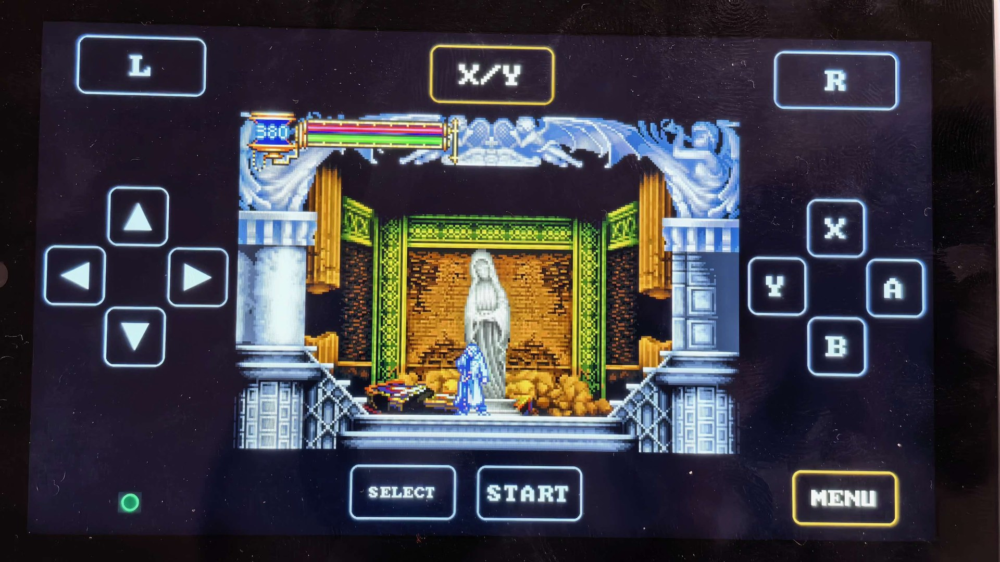
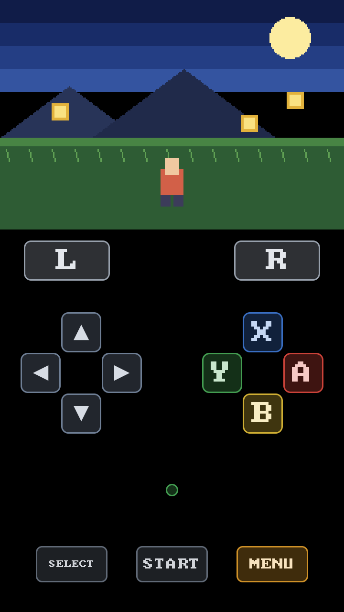
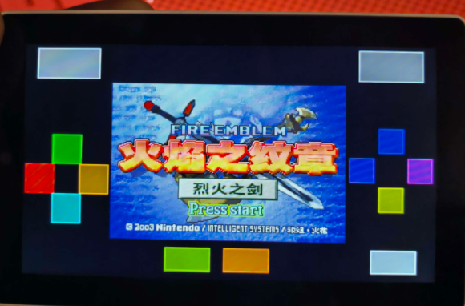

# retro-go-tab5

**English** · [中文](README_CN.md)

**The first full-speed GBA emulator for the M5Stack Tab5 (ESP32-P4) — GBA at a solid 60 FPS with a RISC-V dynamic recompiler, plus the other 10 retro-go systems in the same firmware: GB · GBC · NES · SNES · SMS · Game Gear · ColecoVision · PC Engine · Lynx · Game & Watch.**
**Tab5 上首个满帧 GBA 模拟器（ESP32-P4）—— RISC-V 动态重编译，稳稳跑满 60 FPS；同一个固件里还装着 retro-go 的其余 10 个机种：GB · GBC · NES · SNES · SMS · Game Gear · ColecoVision · PC Engine · Lynx · Game & Watch。**

The Tab5 is a 1280x720 MIPI-DSI handheld built on the ESP32-P4 — a dual-core RISC-V SoC with 32 MB of PSRAM and no wireless radio at all.
retro-go is a lightweight multi-system emulator frontend. This repository is the port: board bring-up, display path, audio, input,
and a GBA core that JIT-compiles ARM/Thumb into native RISC-V so the CPU-emulation cost stops being the bottleneck.

Built and tested on real hardware. Contributions very welcome — see [Contributing](#contributing).

## Download & install — pick the right file

Since v0.4.9 there is **only one build**: the single-app form — the menu and all 11 emulator cores compile
into one app. Pick one file per channel, and **there is no wrong build to install any more** (that was a
problem of the old two-app packaging).

| Where you install from | File | Why |
|---|---|---|
| **M5Burner** (recommended) or esptool | `retro-go-tab5-<version>-merged.bin` | Full image (bootloader@0x2000 + partition table@0x8000 + launcher@0x10000), written from 0x0 |
| **[M5Launcher](https://github.com/bmorcelli/Launcher)** | `retro-go-tab5-<version>-launcher-singleapp.bin` | That platform can only install a **single app image**; this is the app-only image of the very same build (menu + every core) |

**This release is the single-app form**: the in-menu `Check for updates` is gone (it needs a second app
partition to stage a new firmware) — same trade-off as v0.4.7. Upgrade with a full M5Burner / esptool
write of the merged image.

**Upgrading from 0.4.8: flash the whole merged image.** The partition table changed in 0.4.9 (three app slots
→ one 1984K slot); a full M5Burner / esptool write updates the table as well. Do not flash the app partition
alone — the old 960K slot does not fit.

Both files are attached to each [release](../../releases).

### If you see "SD Card Error / Storage mount failed"

**Reseat the microSD card**, then do a **full power cycle** (power off and on — a reset button is not enough).
That is the only way to recover a card that has entered an unresponsive state; the firmware retries
automatically but cannot revive a card that is already wedged. The same applies if it started after
using a third-party launcher (e.g. M5Launcher).

## Screenshots

**Landscape on real hardware (v0.4.9)** — game centred, D-pad on the left, A/B/X/Y on the right, L / R in the
top corners, and the **X/Y ↔ L/R swap key centred between L and R**:



*Landscape mode, v0.4.9 build, photographed on real hardware on 2026-10-10 (M5Stack Tab5 / ESP32-P4 /
native 720x1280 panel). Every label and position in this shot comes from the firmware's own landscape layout
table (`retro-go-p4/components/retro-go/targets/tab5/touch_layout.h`) — it is not an illustration.*
*横屏模式、v0.4.9 构建，2026-10-10 真机拍摄；图中按键名称与位置均出自固件自己的横屏布局表，不是示意画。*

**Portrait layout (v0.4.1)** — this image is rendered from the firmware's own drawing rules (same touch
layout table, same key colours, same bitmap font), so it is exactly what the device draws:



*The 720x480 game screen is anchored to the top of the native portrait 720x1280 panel; the touch gamepad
lives in the control area underneath and never overlaps the game. The round light in the middle of the
control area is the battery indicator (green ≥60% / amber 20-60% / red 10-20% / blinks below 10%, breathes while charging).*
*游戏画面固定在原生竖屏 720x1280 面板的顶部（720x480），触摸手柄在下方的控制区，永不遮挡画面；
控制区正中那个圆灯是电量指示（绿 ≥60% / 橙 20~60% / 红 10~20% / 低于 10% 与充电时闪烁）。*

Earlier hardware photo — the v0.3 landscape layout, before the portrait rework:



*Fire Emblem: The Blazing Blade on a real Tab5 (v0.3): the game stays in the middle and the gamepad is
drawn in the letterbox margins.*
*《火焰之纹章：烈火之剑》真机照片（v0.3 横屏布局）：画面居中，手柄画在留白区。*

---

## Status

Honest status, measured on the device (not aspirational):

| Component | State | Notes |
|---|---|---|
| Launcher (ROM browser, menus) | ✅ Working | Touch-driven, 1:1 rendering (no scaling artifacts). First-run guide card on the GBA page (bilingual: A opens the list, where ROMs go) |
| GBA core (gpSP) | ✅ Working | Interpreter + **RISC-V dynarec** (JIT), ~2x faster than the interpreter |
| **Cores — 11 consoles** | ✅ Working | GBA, GB, GBC, NES, SNES, SMS, Game Gear, ColecoVision, PC Engine, Lynx, Game & Watch — each with its own window size and integer zoom |
| **Touch skins** | ✅ Working | Four switchable control-panel palettes (NVS `TouchSkin`). Only the control area is themed — the game screen and its letterbox bars are never touched |
| **Per-console controls** | ✅ Working | Decided by **what the real controller has** (not by what the upstream core mapped). SNES gets real X/Y/L/R via a new default "Full" preset; GB/GBC/NES/SMS/GG get X/Y as turbo; ColecoVision gets neither |
| Audio | ✅ Working | ES8388 codec over I2S, 32 kHz, no frame-rate impact |
| Savestates | ✅ Working | Core-level state written to and restored from the SD card |
| Touch virtual gamepad | ✅ Working | Portrait layout: the 720x480 game screen is pinned to the top, the gamepad sits in the control area below it (D-pad bottom-left, diamond ABXY bottom-right with per-key colours, L/R in the top corners, SELECT/START/MENU along the bottom). Never overlaps the game |
| Chinese (CJK) support | ✅ Working | Built-in 3773-glyph CJK font (full GB2312 level-1, OFL-1.1) **compiled into the firmware image** — works no matter how the firmware was installed (a standalone font *partition* gets recreated as a FAT partition by installers like M5Launcher, which would silently lose it and turn Chinese text into boxes); all 197 UI strings localized |
| Display path | ✅ Working | Block transpose into on-chip SRAM + AXI-QoS priority, and a bounded retry instead of silently dropped frames (v0.3 rework: ~30 fully-rendered frames/sec, no more drift over time) — see [Performance](#performance) |
| Battery gauge | ✅ Working | INA226 power monitor on the BSP I2C bus (0x41), 2S pack voltage → percentage; shown as the coloured indicator light in the control area (blinks below 10%, breathes while charging) |
| USB-C charging | ✅ Working | The board's charge-enable (`CHG_EN`) is left **low** by the vendor BSP's IO-expander init (its own comment claims otherwise), so the IP2326 charge IC stays disabled and the pack never charges. The firmware now asserts it explicitly after init, mirroring M5's own demo. Measured on hardware: **-0.75 ~ -0.87 A** into the pack, pack voltage climbing (7627 → 7745 mV) |
| Other cores in upstream retro-go (MD, MSX, ...) | ❌ Not ported | The 11 consoles above are wired for this target; the remaining retro-go cores are not |

**Logical speed is full speed**: GBA titles run at 59-60 fps of emulated time with audio in sync.
What is *not* yet at 60 is the number of frames the display path actually pushes to the panel (see below).

---

## Hardware

| | |
|---|---|
| Board | M5Stack Tab5 |
| SoC | ESP32-P4, dual-core RISC-V @ 360 MHz |
| RAM | 32 MB PSRAM + 736 KB internal SRAM |
| Flash | 16 MB |
| Display | 1280x720 MIPI-DSI, ST7123 integrated panel (native portrait 720x1280; the landscape mode is a software rotation) |
| Touch | ST7123, integrated with the panel, I2C 0x55 |
| Audio | ES8388 codec (I2S) |
| Storage | microSD (SDMMC) |

Note: the ESP32-P4 has **no Wi-Fi and no Bluetooth**. Anything network-related in upstream retro-go is compiled out for this target.

---

## Quick start

```bash
# 1. Get ESP-IDF v5.5 and export it (see BUILDING.md for the exact pitfalls)
. ~/esp/esp-idf-v5.5/export.sh

# 2. Release form — single app (menu + every core in one app; both orientations supported)
cd retro-go-p4
python3 rg_tool.py --target tab5 --no-networking --single-app build-img launcher gbsp
#    one-shot wrapper with the image-shape gates: bash tools/build-tab5-skin.sh single-app

# 2b. Legacy two-app form (menu and cores in separate partitions; kept for regression comparison)
python3 rg_tool.py --target tab5 --no-networking build-img launcher gbsp retro-core

# 3. Flash
python3 -m esptool --chip esp32p4 -p /dev/cu.usbmodemXXXX -b 921600 \
  write-flash --flash-mode dio --flash-size 16MB --flash-freq 80m \
  0x0 build/tab5-retro-go.img
```

Full details, the `--no-networking` trap, and serial-monitor caveats: **[BUILDING.md](BUILDING.md)**.

---

## Controls

The Tab5 has almost no physical buttons, so the gamepad is drawn on the touch screen — and its position
**follows the orientation** (the game viewport is 720x480 and is never overlapped).
**Since v0.4.9 one image supports both orientations**: asked at first boot, changeable later in
`Options → Screen orientation` (the choice is stored in NVS and the device reboots into it).

**Portrait** — game pinned to the top, pad in the control area below:

```
+----------------------------------+
|         game screen 720x480      |   <- 3x integer scale, never overlapped
+----------------------------------+
| [L]                          [R] |
|                                  |
|  [D-pad]    (LED)           [X]  |   (LED) = battery light
|             battery      [Y] [A] |         green/amber/red
|                            [B]   |
|                                  |
|    [SELECT]  [START]  [MENU]     |
+----------------------------------+
```

**Landscape** — game centred, pad split to the two sides (where the thumbs already are):

```
+----------------------------------------------------------------+
| [L]                    [ X/Y ]                          [R]    |   <- X/Y centred between L and R
|                                                                |
|    [^]                                                         |
| [<]   [>]       game screen 720x480 (centred)         [X]      |
|    [v]                                          [Y]       [A]  |
|                                                                |
|                  [MENU]          [SELECT]   [START]   (LED)    |
+----------------------------------------------------------------+
```

- **Orientation** — `Options → Screen orientation` switches portrait / landscape (asked at first boot;
  the choice persists in NVS and the device reboots into it)
- **D-pad** — portrait: control area, bottom-left; landscape: left side of the screen
- **A / B / X / Y** — control area, bottom-right, diamond layout, each key its own colour
- **L / R** — top corners of the control area (consoles that have shoulder buttons: **GBA and SNES**)
- **Swap L/R with X/Y** — GBA only
- **X / Y** — depends on the console:
  - **GB / GBC / NES / SMS / Game Gear** — Turbo A / Turbo B (hold to auto-fire)
  - **SNES** — real X / Y buttons (they are *not* turbo)
  - **GBA** — real X / Y buttons
  - **ColecoVision / PC Engine / Lynx / Game & Watch** — not shown (the real hardware has no X/Y)
- **START / SELECT** — bottom centre
- **MENU** — open the in-game menu (savestates, options, reset)
- **Battery light** — centre of the control area: green ≥60% / amber 20-60% / red 10-20% / blinks below 10%, breathes while charging
- **Language** — Options → Language switches the UI to Chinese (English by default; the choice persists in NVS)
- **Touch skin** — four switchable control-panel colour palettes (Options). Only the control area is themed; the game screen is never touched

### Controls per console

The layout follows **what the real controller has**, not what the upstream core happened to map:

| Console | Face buttons | Shoulders | Turbo |
|---|---|---|---|
| GBA | X / Y / A / B | L / R (+ swap button) | — |
| SNES | X / Y / A / B | L / R | — |
| GB / GBC / NES | A / B | — | X / Y |
| SMS / Game Gear | A / B | — | X / Y |
| ColecoVision | A / B | — | — |
| PC Engine / Lynx / Game & Watch | A / B | — | — |

Layout reference: [docs/touch-layout-p2.png](docs/touch-layout-p2.png) (landscape era) ·
[docs/screenshot-portrait.png](docs/screenshot-portrait.png) (current portrait layout)

---

## Performance

Measured on hardware with the dynarec enabled, Pokémon Emerald:

```
FPS:61 (46+0+15)     BUSY:32-56%
 |    |  |  |
 |    |  |  +-- frames fully drawn
 |    |  +----- partially drawn
 |    +-------- skipped
 +------------- logical fps
```

- **Logical fps: 59-60** — the emulated console runs at full speed, audio in sync, no pitch drift.
- **Drawn fps: ~15** — the display path (CPU transpose + PSRAM write-back) is the ceiling, not the CPU emulation
  (BUSY peaks around 56%, so there is headroom).

The obvious fix — decoupling the emulator from the display with a deeper queue and triple buffering — **was implemented and measured**:
drawn frames doubled from 15 to 30/sec and the picture got visibly smoother. **It was then reverted**: on this board it periodically
wedges the display path (screen freezes, no panic log, power cycle required) because the DPI scan-out (~106 MB/s of continuous PSRAM traffic
at 1280x720@60 Hz) leaves almost no arbitration headroom for a second concurrent writer. That is a property of this panel size, not of the queue design.

**The remaining safe direction is to push *fewer bytes per frame*** — e.g. only submitting the rows the core actually changed.
See [ROADMAP.md](ROADMAP.md).

---

## Repository layout

```
retro-go-p4/            the retro-go tree (upstream source + this port)
  components/retro-go/  framework core: system, display, input, audio, storage, targets/
    targets/tab5/       board target: config.h, env.py, sdkconfig
  launcher/             ROM browser app
  gbsp/                 GBA emulator app (gpSP + RISC-V dynarec)
  rg_tool.py            upstream build/flash driver
vendor/                 vendored third-party components required to build
  m5stack_tab5/         M5Stack Tab5 BSP (vendored copy)
  esp_lcd_st7121/       panel driver
tools/                  build / flash / serial-log helper scripts
docs/                   porting reference docs (Chinese) + touch layout diagram
docs/archive/           process docs kept for the record (one-night logs, handoffs, code reviews,
                        skin candidates) — see docs/archive/README.md for what is there and why
```

### What is upstream and what is this port

`retro-go-p4/` is a full copy of upstream [retro-go](https://github.com/ducalex/retro-go) with local modifications, so the
directory listing alone will not tell you which files this port touched. That boundary is computed mechanically:
[docs/UPSTREAM-DIVERGENCE.md](docs/UPSTREAM-DIVERGENCE.md) — of the 841 upstream files, **746 are byte-identical,
70 were modified by this port, 173 are new and 25 were not carried over**. Read it before editing an upstream file;
it is also the only list you need to walk when following upstream updates.

> This GitHub repository is the **published mirror** of the maintainer's development tree: `README*`, `CONTRIBUTING*`,
> `ROADMAP*`, `CHANGELOG*`, `CREDITS.md`, `LICENSE` and `.github/` exist only here; everything else is mirrored wholesale.
> Before contributing, see "Where your change lives" in [CONTRIBUTING.md](CONTRIBUTING.md).

---

## Porting notes

The development journal for this port — board bring-up findings, hardware facts that were verified the hard way
("do not retry these"), display-architecture notes, and the debugging order — lives in
[docs/TAB5-PORT-STATUS.md](docs/TAB5-PORT-STATUS.md) (written in Chinese).

Process material that has served its purpose — the portrait handoff, the display-bandwidth night log, the SNES
performance session, the v0.4.1 code walk-through and the skin candidates — is kept under
[docs/archive/](docs/archive/README.md) with an index saying what each file is; the originals are also pasted into
the release notes, so nothing is lost by archiving. `docs/` itself keeps only documents that still describe the
current state.

## Contributing

This project exists because a device with no upstream support got one anyway. If you have a Tab5, an ESP32-P4 board, or just
an interest in RISC-V JIT work, there is plenty to do:

- **[ROADMAP.md](ROADMAP.md)** — the concrete open items, roughly ordered
- **[CONTRIBUTING.md](CONTRIBUTING.md)** — how to build, test, and submit changes
- **Good first issues**: battery gauge (INA226), push-only-changed-rows display path, porting another core, docs and screenshots

A few house rules that come from doing this on real hardware:

1. **One visible change per flash.** Flash, look at the screen, then continue.
2. **No serial-console debugging loops.** On this board, opening the USB-CDC port resets the device — so verification is visual
   (or by reading `/crash.log` off the SD card).
3. **Anything touching the display path or PSRAM bandwidth must ship behind a runtime switch** (an opt-in file on the SD card),
   so a bad experiment can be rolled back without reflashing.

---

## Credits

This port stands on other people's work:

- **[retro-go](https://github.com/ducalex/retro-go)** by Alex Duchesne (ducalex) — the emulator frontend this is a port of. GPLv2.
- **[gpSP](https://github.com/libretro/gpsp)** — the Game Boy Advance core. GPLv2.
- **[HowBoyAdvance](https://github.com/Irak4t0n/HowBoyAdvance)** — the ESP32-P4 GBA project whose RISC-V dynarec this port's
  JIT backend is derived from (the derivation chain runs through gpSP, GPLv2). Credit for the dynarec approach belongs there.
  Two backend defects this port found are reported upstream:
  [#2 cycle-accounting divergence](https://github.com/Irak4t0n/HowBoyAdvance/issues/2) and
  [#3 div/rem remainder semantics](https://github.com/Irak4t0n/HowBoyAdvance/issues/3).
  ⚠️ That repository currently ships **no licence file** (its issue #1 asks about it), so this port only declares
  *its own* GPLv2 status — it does not label upstream.
- **M5Stack** — the Tab5 BSP and hardware documentation.
- **Espressif** — ESP-IDF, and the PPA/DMA2D and MIPI-DSI drivers the display path experiments were built on.

## License

**GPLv2** — see [LICENSE](LICENSE). This is a derivative work of retro-go (GPLv2) and of the HowBoyAdvance dynarec (GPLv2),
so it must remain GPLv2. If you distribute a firmware image built from this repository, you must make the corresponding source available.

ROMs are **not** included and never will be. Bring your own legally obtained dumps.
