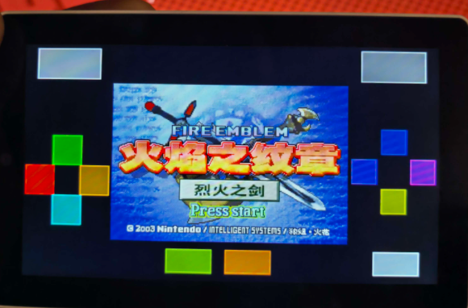

# retro-go-tab5

[English](README.md) · **中文**

**把 [retro-go](https://github.com/ducalex/retro-go) 移植到 M5Stack Tab5（ESP32-P4），并为 GBA 实现 RISC-V 动态重编译（dynarec）。**
**A port of [retro-go](https://github.com/ducalex/retro-go) to the M5Stack Tab5 (ESP32-P4), with a RISC-V dynamic recompiler for Game Boy Advance.**

Tab5 是一台 1280x720 的 MIPI-DSI 掌机，主控是 ESP32-P4 —— 双核 RISC-V、32MB PSRAM、**完全没有无线模块**。
retro-go 是一个轻量多机种模拟器前端，本仓库是它的移植：板级点亮、显示通路、音频、输入，
以及一个把 ARM/Thumb 直接 JIT 编译成 RISC-V 原生指令的 GBA 核心 —— 让"CPU 模拟"不再是瓶颈。

全部在真机上验证过。**非常欢迎一起共建** —— 见 [参与共建](#参与共建)。

## 截图



*《火焰之纹章：烈火之剑》在真机 Tab5 上运行 —— 彩色触摸手柄只画在留白区，不遮挡游戏画面。*
*Fire Emblem: The Blazing Blade running on a real Tab5. The coloured touch gamepad is drawn only in the
letterbox margins, so it never covers the game.*

---

## 现状（实测，不是愿景）

| 模块 | 状态 | 说明 |
|---|---|---|
| Launcher（ROM 浏览、菜单） | ✅ 可用 | 触摸驱动，1:1 渲染（无缩放伪影） |
| GBA 核心（gpSP） | ✅ 可用 | 解释器 + **RISC-V dynarec**（JIT），比解释器快约 2 倍 |
| 音频 | ✅ 可用 | ES8388 + I2S，32kHz，不影响帧率 |
| 存档（Savestate） | ✅ 可用 | 核心级状态（约 416KB）写入 SD 卡 |
| 触摸虚拟手柄 | ✅ 可用 | ABXY 菱形排布、每键独立颜色，只画在画面留白区 |
| 中文支持 | ✅ 可用 | 内置 3773 字形 CJK 字库（GB2312 一级全覆盖，OFL-1.1），存**独立 flash 分区**：零加载、全 app 共享、不依赖 SD 卡；界面菜单 197 条全中文化 |
| 显示通路 | ⚠️ CPU 转置 | 逻辑满速 60fps，但真正推送到屏上约 15 帧/秒；**长时间运行还会退化**（转置耗时 47ms→431ms 持续增长、DSI 报“上一次绘制未完成”）—— 见[性能](#性能) 与 [移植笔记第九节](docs/TAB5-PORT-STATUS.md) |
| 电池电量 | ❌ 未实现 | 日志里是 `BATT:0`；Tab5 板载 INA226 |
| 其它机种（NES/SNES/MD/PCE…） | ❌ 未移植 | retro-go 源码里有，但只为本目标接线了 launcher + GBA |

**逻辑速度是满速**：GBA 游戏以 59~60fps 的模拟时间运行，音频同步、不变调。
**没有**跑到 60 的是"显示通路真正推给面板的帧数"（见下）。

---

## 硬件

| | |
|---|---|
| 板子 | M5Stack Tab5 |
| 主控 | ESP32-P4，双核 RISC-V @ 360 MHz |
| 内存 | 32MB PSRAM + 736KB 内部 SRAM |
| Flash | 16MB |
| 屏幕 | 1280x720 MIPI-DSI，ST7123 一体屏（原生竖屏 720x1280，横屏是软件旋转） |
| 触摸 | ST7123，与面板一体，I2C 地址 0x55 |
| 音频 | ES8388 codec（I2S） |
| 存储 | microSD（SDMMC） |

注意：ESP32-P4 **没有 Wi-Fi、没有蓝牙**。上游 retro-go 里所有联网相关代码在本目标下都被编译掉了。

---

## 快速开始

```bash
# 1. 准备 ESP-IDF v5.5 并导出环境（坑很多，见 BUILDING.md）
. ~/esp/esp-idf-v5.5/export.sh

# 2. 构建两个 app（launcher + GBA），合成一个可刷镜像
cd retro-go-p4
python3 rg_tool.py --target tab5 --no-networking build-img launcher gbsp

# 3. 刷机
python3 -m esptool --chip esp32p4 -p /dev/cu.usbmodemXXXX -b 921600 \
  write-flash --flash-mode dio --flash-size 16MB --flash-freq 80m \
  0x0 build/tab5-retro-go.img
```

完整步骤、`--no-networking` 这个坑、以及串口监视的注意事项：**[BUILDING_CN.md](BUILDING_CN.md)**。

---

## 操作方式

Tab5 几乎没有物理按键，所以手柄画在触摸屏的画面留白区（游戏视口 720x480，两侧留出按键区）：

- **方向键** —— 左侧留白区
- **A / B / X / Y** —— 右侧留白区，菱形排布，每键独立颜色
- **MENU** —— 打开游戏内菜单（存档 / 选项 / 重置）
- **OPTION** —— 选项菜单
- **语言** —— Options → Language 可切中文（默认英文；选择写入 NVS 持久保存）

布局参考：[docs/touch-layout-p2.png](docs/touch-layout-p2.png)

---

## 性能

真机实测（开 dynarec，宝可梦 绿宝石）：

```
FPS:61 (46+0+15)     BUSY:32-56%
 |    |  |  |
 |    |  |  +-- 完整画出的帧
 |    |  +----- 部分画出的帧
 |    +-------- 跳过的帧
 +------------- 逻辑帧率
```

- **逻辑帧率 59~60** —— 模拟主机满速运行，音频同步、不变调。
- **绘制帧率约 15** —— 瓶颈在显示通路（CPU 转置 + PSRAM 写回），**不在** CPU 模拟（BUSY 峰值才 ~56%，还有余量）。

最直接的做法 —— 用更深的队列 + 三缓冲把模拟器和显示解耦 —— **已经实现并实测过**：
绘制帧从 15 翻到 30/秒，画面肉眼明显更顺。**但随后已回退**：在这块板上它会周期性把显示通路楔死
（画面定格、不写 panic 日志、只能断电恢复），原因是 DPI 持续扫屏在 1280x720@60Hz 下就要吃掉约 106MB/s 的 PSRAM 带宽，
几乎没有余量再容纳第二路并发写。这是**面板尺寸**的性质，不是队列设计的问题。

**剩下唯一安全的方向是"每帧推送更少的字节"** —— 例如只提交核心真正改动过的那些行。见 [ROADMAP_CN.md](ROADMAP_CN.md)。

---

## 仓库结构

```
retro-go-p4/            retro-go 源码树（上游代码 + 本次移植）
  components/retro-go/  框架核心：system / display / input / audio / storage / targets/
    targets/tab5/       板级目标：config.h、env.py、sdkconfig
  launcher/             ROM 浏览前端
  gbsp/                 GBA 模拟器（gpSP + RISC-V dynarec）
  rg_tool.py            上游的构建/刷机驱动脚本
vendor/                 构建所需的三方组件（内置副本）
  m5stack_tab5/         M5Stack Tab5 BSP
  esp_lcd_st7121/       面板驱动
tools/                  构建 / 刷机 / 抓日志的辅助脚本
docs/                   移植笔记（中文）+ 触摸布局图
```

---

## 移植笔记

本移植的开发日志 —— 板级点亮过程、花了很多代价才确认的硬件事实（"不要重新试错"那张表）、显示架构笔记、
以及真机调试的检查顺序 —— 都在 [docs/TAB5-PORT-STATUS.md](docs/TAB5-PORT-STATUS.md)。

## 参与共建

这个项目之所以存在，是因为一台"上游不支持"的设备最后被支持了。如果你手上有 Tab5、有 ESP32-P4 板子，
或者对 RISC-V JIT 感兴趣 —— 这里有大量可做的事：

- **[ROADMAP_CN.md](ROADMAP_CN.md)** —— 具体待办，大致按优先级排序
- **[CONTRIBUTING_CN.md](CONTRIBUTING_CN.md)** —— 怎么构建、怎么测、怎么提 PR
- **适合上手的**：电池电量（INA226）、"只推送改动行"的显示通路、移植另一个机种、文档与截图

几条来自真机实战的约定：

1. **一次刷机 = 一个可见变化**。刷进去、看屏幕、再继续。
2. **不用串口做调试循环**。这块板上打开 USB-CDC 串口会复位设备 —— 所以验证靠"看画面"或"从 SD 卡读 `/crash.log`"。
3. **任何动显示通路或 PSRAM 带宽的改动，必须带运行时开关**（SD 卡上放个文件才启用），这样坏实验不用重刷就能回退。

---

## 致谢

这个移植站在别人的肩膀上：

- **[retro-go](https://github.com/ducalex/retro-go)**（作者 Alex Duchesne / ducalex）—— 本移植所基于的模拟器前端，GPLv2。
- **[gpSP](https://github.com/libretro/gpsp)** —— GBA 核心，GPLv2。
- **[HowBoyAdvance](https://github.com/Irak4t0n/HowBoyAdvance)** —— 本移植的 RISC-V dynarec 后端派生自该 ESP32-P4 GBA 项目的实现，GPLv2。
  dynarec 这条路线的功劳属于他们。
- **M5Stack** —— Tab5 的 BSP 与硬件资料。
- **Espressif** —— ESP-IDF，以及显示通路实验所依赖的 PPA/DMA2D 与 MIPI-DSI 驱动。

## 许可证

**GPLv2** —— 见 [LICENSE](LICENSE)。本仓库是 retro-go（GPLv2）与 HowBoyAdvance dynarec（GPLv2）的衍生作品，
因此必须继续保持 GPLv2。如果你分发基于本仓库构建的固件，你必须同时提供对应源码。

**不包含、也永远不会包含 ROM**。请自备合法取得的游戏文件。
